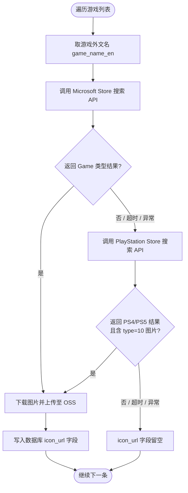
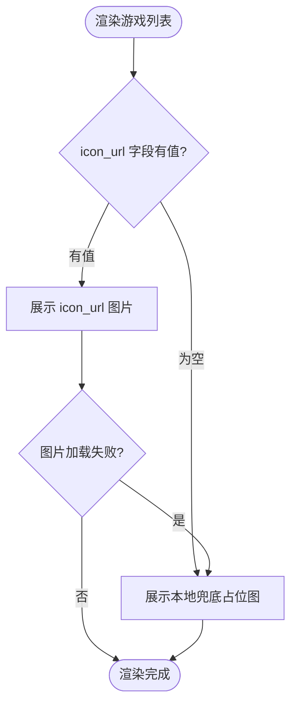

# PRD：游戏图标获取服务

## 1. 背景与目标

游戏图库模块需要展示主机平台（PS / Xbox）游戏的方形图标（约 220×220 px）。  
本方案利用 **Microsoft Store CDN** 和 **PlayStation Store CDN** 的公开接口，按优先级获取游戏的官方图标。

### 目标
- 提供统一的游戏图标获取能力，输入游戏名称，输出方形图标 URL
- 不依赖付费 API Key
- 保证获取失败时有可靠的兜底显示

---

## 2. 整体流程

### 2.1 后台爬取流程（mng 后台批量执行）



### 2.2 前端展示流程（路由器加速页面）



---

## 3. 接口详细规格

### 3.1 Xbox 路径

#### 3.1.1 搜索接口

| 项目 | 内容 |
|------|------|
| 端点 | `GET https://www.microsoft.com/msstoreapiprod/api/autosuggest` |
| 鉴权 | 无需 |
| 用途 | 通过游戏名搜索，获取游戏的图标 URL 和产品 ID |

**请求参数（Query String）：**

| 参数 | 类型 | 必填 | 说明 |
|------|------|------|------|
| `query` | string | 是 | 游戏名称（URL encode） |
| `market` | string | 是 | 固定填 `en-US` |
| `clientId` | string | 是 | 固定填 `7F27B536-CF6B-4C65-8638-A0F8CBDFCA65` |
| `sources` | string | 是 | 固定填 `DCatAll-Products` |
| `filter` | string | 是 | 固定填 `+ClientType:StoreWeb`（需 URL encode 为 `%2BClientType%3AStoreWeb`） |
| `counts` | string | 否 | 返回条数，默认 `5` |

**示例请求：**
```
GET https://www.microsoft.com/msstoreapiprod/api/autosuggest?market=en-US&clientId=7F27B536-CF6B-4C65-8638-A0F8CBDFCA65&sources=DCatAll-Products&filter=%2BClientType%3AStoreWeb&counts=5&query=Grand+Theft+Auto+V
```

**响应结构（关键字段）：**
```jsonc
{
  "ResultSets": [{
    "Source": "searchacs-products",
    "Suggests": [{
      "Source": "Game",           // 产品类型：Game 表示是游戏
      "Title": "Grand Theft Auto V (Xbox One)",
      "ImageUrl": "//store-images.s-microsoft.com/image/apps.7814.68565266983380288.0f5ef871-88c0-45f7-b108-6aacbc041fcf.b7e42789-b2bf-4b60-bf0a-f891f2f04226",
      "Metas": [
        { "Key": "BigCatalogId", "Value": "BPJ686W6S0NH" },
        { "Key": "ProductType", "Value": "Games" },
        { "Key": "ImageWidth",  "Value": "1080" },
        { "Key": "ImageHeight", "Value": "1080" },
        { "Key": "ImageType",   "Value": "BoxArt" }
      ]
    }]
  }]
}
```

#### 3.1.2 图标 URL 拼接规则

从搜索结果中取 `ImageUrl`，加上 `https:` 前缀和缩放参数即可：

```
https:{ImageUrl}?mode=scale&q=90&w={width}&h={height}&format=jpg
```

**缩放参数说明：**

| 参数 | 说明 | 推荐值 |
|------|------|--------|
| `w` | 目标宽度 px | `220` |
| `h` | 目标高度 px | `220` |
| `mode` | `scale`=等比缩放 / `letterbox`=留白填充 | `scale` |
| `q` | 图片质量 1-100 | `90` |
| `format` | `jpg` 或 `png` | `jpg` |

**GTA5 最终图标 URL：**
```
https://store-images.s-microsoft.com/image/apps.7814.68565266983380288.0f5ef871-88c0-45f7-b108-6aacbc041fcf.b7e42789-b2bf-4b60-bf0a-f891f2f04226?mode=scale&q=90&w=220&h=220&format=jpg
```

#### 3.1.3 判定逻辑

- 从 `Suggests` 数组中，筛选 `Source === "Game"` 的结果
- 若 `Suggests` 为空或无 Game 类型结果 → 判定为失败，进入 PS 路径
- 若有多条结果，取第一条（默认按相关性排序）

---

### 3.2 PlayStation 路径

#### 3.2.1 搜索接口

| 项目 | 内容 |
|------|------|
| 端点 | `GET https://store.playstation.com/store/api/chihiro/00_09_000/tumbler/{region}/{language}/{age}/{keyword}` |
| 鉴权 | 无需 |
| 用途 | 通过游戏名搜索，获取游戏的产品信息和图片列表 |

**路径参数：**

| 参数 | 类型 | 说明 |
|------|------|------|
| `region` | string | 地区代码，推荐 `US` |
| `language` | string | 语言代码，推荐 `en` |
| `age` | string | 年龄限制，填 `999` 表示不过滤 |
| `keyword` | string | 游戏名称（URL encode） |

**示例请求：**
```
GET https://store.playstation.com/store/api/chihiro/00_09_000/tumbler/US/en/999/Grand+Theft+Auto+V
```

**响应结构（关键字段）：**
```jsonc
{
  "links": [
    {
      "id": "UP1004-CUSA00419_00-GTAVDIGITALDOWNL",
      "name": "Grand Theft Auto V",
      "playable_platform": ["PS4™"],
      "images": [
        { "type": 10, "url": "https://apollo2.dl.playstation.net/cdn/UP1004/CUSA00419_00/bTNSe7ok8eFVGeQByA5qSzBQoKAAY32R.png" },
        { "type": 12, "url": "https://apollo2.dl.playstation.net/cdn/UP1004/CUSA00419_00/pa94XuKpFNkvKMEWO1LU8XE46bKRVccu.jpg" }
      ]
    }
  ]
}
```

#### 3.2.2 图片 type 定义

| type | 说明 | 形状 |
|------|------|------|
| `1` | 小缩略图 | 不定 |
| `2` | 标准缩略图 | 不定 |
| `9` | 大缩略图 | 不定 |
| **`10`** | **游戏图标** | **方形（目标字段）** |
| `12` | 横版背景图 | 横版 |
| `13` | 附加背景图 | 横版 |

#### 3.2.3 图标 URL 使用

取 `images` 数组中 `type === 10` 的 `url` 字段直接使用：
```
https://apollo2.dl.playstation.net/cdn/UP1004/CUSA00419_00/bTNSe7ok8eFVGeQByA5qSzBQoKAAY32R.png
```

等效域名（可替换使用）：
```
https://image.api.playstation.com/cdn/UP1004/CUSA00419_00/bTNSe7ok8eFVGeQByA5qSzBQoKAAY32R.png
```

> 注意：PS CDN 不支持 URL 参数缩放，需要前端通过 CSS `width/height` + `object-fit: cover` 控制显示尺寸。

#### 3.2.4 判定逻辑

- 从 `links` 数组中筛选 `playable_platform` 包含 `PS4` 或 `PS5` 的结果
- 从该结果的 `images` 中查找 `type === 10` 的条目
- 若 `links` 为空 / 无 PS4/PS5 平台结果 / 无 type=10 图片 → 判定为失败，进入兜底

---

### 3.3 兜底图

当 Xbox 和 PS 路径均失败时，返回本地预设的默认占位图。

**兜底图要求：**
- 尺寸：220×220 px
- 格式：PNG（带透明通道）
- 内容：游戏手柄 icon + 游戏名文字（可选）
- 存放路径：项目静态资源目录

---

## 4. 异常处理

| 场景 | 处理方式 |
|------|---------|
| 网络请求超时 | 设置 5s 超时，超时视为该路径失败，继续下一级 |
| API 返回非 200 | 视为该路径失败，继续下一级 |
| 搜索结果为空 | 视为该路径失败，继续下一级 |
| 图片 URL 无法加载 | 前端 `` 添加 `onerror` 回调，替换为兜底图 |
| 搜索到多个同名游戏 | 取第一条结果（API 默认按相关性排序） |

---

## 5. 性能与缓存策略

| 策略 | 说明 |
|------|------|
| 本地缓存 | 成功获取的 iconUrl 应缓存（localStorage / 内存），避免重复请求 |
| 缓存有效期 | 建议 7 天（游戏图标几乎不会变化） |
| 缓存 Key | `game_icon_{gameName的MD5或Base64}` |
| 批量优化 | 页面列表渲染时，先检查缓存命中，仅对未命中的发起请求 |
| 请求并发 | 建议限制同时发起的搜索请求不超过 3 个，避免被 CDN 限流 |

---

## 6. 前端展示规范

```html

```

| 属性 | 值 | 说明 |
|------|------|------|
| 尺寸 | 220×220 px | 列表中的统一展示尺寸 |
| 圆角 | 12px | 视觉风格统一 |
| object-fit | cover | 确保方形裁剪 |
| onerror | 替换为兜底图 | 图片加载失败的最终保底 |

---

## 7. 验证示例

### GTA5 - Xbox 路径成功示例

**输入：** `"Grand Theft Auto V"`

**搜索 API 返回的 ImageUrl：**
```
//store-images.s-microsoft.com/image/apps.7814.68565266983380288.0f5ef871-88c0-45f7-b108-6aacbc041fcf.b7e42789-b2bf-4b60-bf0a-f891f2f04226
```

**最终输出 iconUrl：**
```
https://store-images.s-microsoft.com/image/apps.7814.68565266983380288.0f5ef871-88c0-45f7-b108-6aacbc041fcf.b7e42789-b2bf-4b60-bf0a-f891f2f04226?mode=scale&q=90&w=220&h=220&format=jpg
```

### GTA5 - PlayStation 路径备选示例

**搜索 API 返回的 type=10 url：**
```
https://image.api.playstation.com/cdn/UP1004/CUSA00419_00/bTNSe7ok8eFVGeQByA5qSzBQoKAAY32R.png
```

---

## 8. 接口域名清单（白名单/CSP 配置参考）

| 域名 | 用途 |
|------|------|
| `www.microsoft.com` | Xbox 搜索 API |
| `store-images.s-microsoft.com` | Xbox 图片 CDN |
| `store.playstation.com` | PS 搜索 API |
| `image.api.playstation.com` | PS 图片 CDN |
| `apollo2.dl.playstation.net` | PS 图片 CDN（备用域名） |

---

## 9. mng 后台：路由器加速游戏 ICON 管理

### 9.1 需求概述

在 mng 后台的**主机游戏信息管理**（PS 平台与 Xbox 平台）中，为【路由器加速】链路新增**游戏 ICON** 字段。

### 9.2 字段定义

| 字段 | 说明 |
|------|------|
| 字段名 | `router_accel_icon` |
| 类型 | string（图片 URL） |
| 默认值 | 空字符串 `""` |
| 用途 | 路由器加速列表页的游戏图标展示 |
| 图片规格 | 方形，220×220 px，jpg/png |

### 9.3 自动爬取逻辑

#### 触发时机
- 新增游戏条目时自动触发
- 支持后台批量操作：「一键爬取全部缺失 ICON」

#### 爬取规则
1. 使用该游戏的**外文名**（`game_name_en`）作为搜索关键词
2. 按 Xbox → PS 优先级获取图标（具体接口见第 3 章）
3. 爬取成功 → 下载图片 → 上传至 OSS → 将 OSS URL 写入 `router_accel_icon` 字段
4. 爬取失败 → `router_accel_icon` 保持为空，不影响其他字段

#### 批量爬取行为
- 遍历所有 `router_accel_icon` 为空的游戏记录
- 并发限制：同时最多 3 条请求（避免被上游限流）
- 单条超时：5 秒
- 爬取结果记录日志（成功/失败/失败原因），支持后台查看

### 9.4 手动上传

#### 场景
- 自动爬取失败的游戏（ICON 为空）
- 需要替换自动爬取的图片（如官方图更新）

#### 交互设计
- 在游戏编辑页面的 ICON 字段旁提供「上传」按钮
- 支持上传 jpg / png，文件大小限制 2MB
- 上传后自动裁剪/缩放至 220×220 px
- 上传成功后覆盖 `router_accel_icon` 字段值

### 9.5 后台 UI 说明

| 位置 | 说明 |
|------|------|
| 列表页 | 游戏列表中新增 ICON 缩略图列（40×40 展示） |
| 列表页 | 支持按「有无 ICON」筛选 |
| 编辑页 | ICON 字段展示当前图片预览 + 上传按钮 + 删除按钮 |
| 批量操作 | 顶部工具栏增加「批量爬取 ICON」按钮 |

### 9.6 前端展示逻辑

路由器加速游戏列表页读取 `router_accel_icon` 字段：

| 场景 | 展示 |
|------|------|
| 字段有值且图片加载成功 | 展示该 URL 图片 |
| 字段有值但图片加载失败 | 展示兜底占位图（`onerror` 回调） |
| 字段为空 | 展示兜底占位图 |

